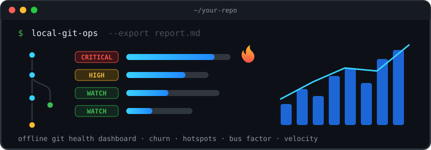

<p align="center">
  
</p>

# local-git-ops

Offline git repository health dashboard. Point it at any local git repository
and get an instant terminal report on code churn, maintenance hotspots, bus
factor, bug clusters, commit velocity and firefighting patterns — no network,
no shell commands, no setup.

Built on [libgit2](https://libgit2.org/) (`git2` crate) for repository access
and [rayon](https://crates.io/crates/rayon) to parallelize diff and line-count
analysis across all CPU cores. A ~50k-commit repository analyzes in under two
seconds.

## Install

```sh
cargo install --path .
```

## Usage

```sh
cd your-repo
local-git-ops                      # dashboard for the last 100 non-merge commits
local-git-ops -n 1000              # widen the analysis window
local-git-ops --days 365           # window by time instead of count
local-git-ops --path src           # scope file metrics to a prefix
local-git-ops --export report.md   # also write the report as Markdown
local-git-ops --export report.html # … or as a self-contained HTML page
```

Run it from a subdirectory (`app/`, `src/`, …) and file metrics automatically
scope to that prefix — lockfiles and generated code at the root won't drown the
signal. Use `--no-auto-scope` to disable, `--no-default-filters` to include
lockfiles/changelogs/vendored files.

## What it measures

| Section | Question it answers |
|---------|---------------------|
| 🔥 Maintenance Hotspots | Which files are both big and constantly changing? (churn × size score; flagged `CRITICAL` when they also attract bug fixes) |
| 📈 Code Churn | What changes the most? (lockfiles, changelogs and generated code excluded by default) |
| 🐛 Bug Clusters | Where do `fix`/`bug`/`broken` commits land? Files high on both this and the churn list are your single biggest risk. |
| 👥 Ownership & Bus Factor | Who built this, who maintains it now? Flags a top contributor owning ≥60% of commits, top contributors inactive 6+ months, and single-author knowledge silos. |
| 📊 Commit Velocity | Is the project accelerating or dying? Commits per month over the entire history, with trend detection (steady / declining / cliff / spiky). |
| 🚒 Firefighting | How often does the team revert, hotfix or roll back? |

The methodology follows churn-based defect analysis (Nagappan & Ball,
Microsoft Research 2005; Adam Tornhill, *Your Code as a Crime Scene*): change
frequency predicts defects better than static complexity alone, and the
overlap of high churn with high bug density marks the riskiest code.

Caveats worth knowing: bug and firefight detection depend on commit message
discipline, and squash-merge workflows compress authorship to whoever merged.

## Options

```text
-n, --commits <N>      window size, default 100 non-merge commits
    --days <D>         alternative window: last D days
    --path <PREFIX>    scope file metrics to a path prefix
    --no-auto-scope    don't auto-scope to the current subdirectory
    --no-default-filters
                       include lockfiles/changelogs/vendored/generated files
    --top <N>          rows per table, default 20
    --export <FILE>    also write the report to a file; format chosen by
                       extension (.html/.htm → HTML, anything else → Markdown)
    --repo <PATH>      repository location, default "." (discovers upward)
```

## Development

```sh
make help       # list all targets
make install    # build and install into ~/.cargo/bin
make test       # unit + integration tests
make check      # fmt-check + clippy -D warnings + tests (same gate as CI)
make run ARGS="--export report.md"
```

CI (GitHub Actions) runs lint, tests (Linux + macOS) and an MSRV (1.88) check
for every push and pull request. Tagging `v*` builds tested release binaries
for Linux (x86_64 gnu/musl, arm64), macOS (x86_64, arm64) and Windows, then
publishes them in a single release with a combined `SHA256SUMS` file.

## License

MIT
